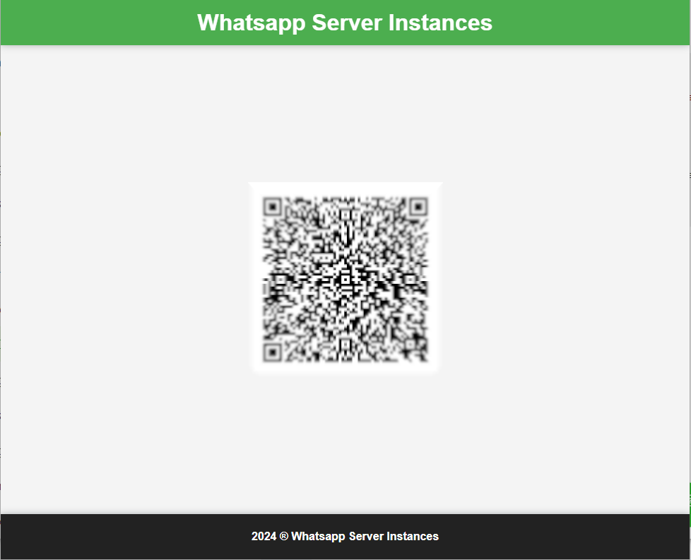
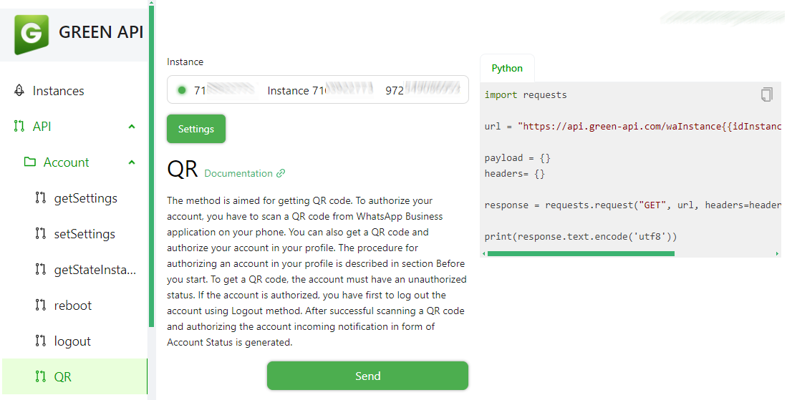
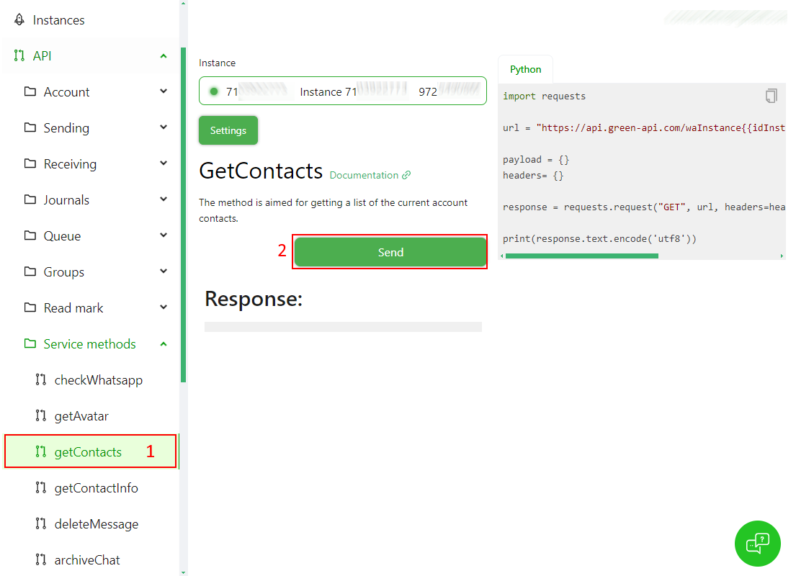
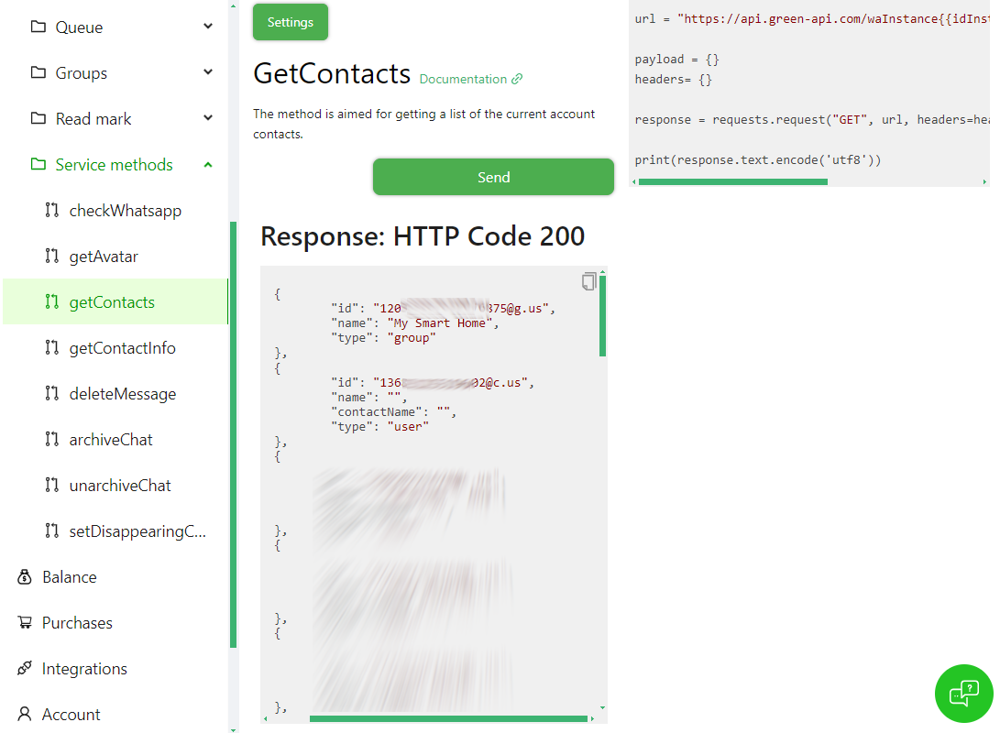

# GreenApi Arduino Library

The GreenApi Arduino Library allows you to easily send WhatsApp messages from your Arduino projects using the Green-API service. This library simplifies the process of integrating WhatsApp messaging capabilities into your Arduino sketches.

## Introduction

The GreenApi library provides a simple interface to interact with the Green-API service for sending WhatsApp messages. It abstracts away the complexities of HTTP requests and JSON formatting, allowing you to focus on your project's functionality.


## Getting started

### Setup Green API account
Nevigate to [https://green-api.com/en](https://green-api.com/en) and register for a new account:


Fill up your details and click on **Register**:


Next, click on the "Create an instance":


Select the "Developer" instance (Free):


Copy the InstanceId and Token, we need it for the integration settings:


Next, Lets connect our whatsapp with green-api. On the left side, Under API --> Account, click on QR and copy the QR URL to the browser and click on "Scan QR code"


Next, Scan the QR code to link you whatsapp with Green API:



After the account link, you will notice that the instance is active by the green light in the instance header:



### Getting the Contacts and Groups
Before we can start messaging, we need to get the Contact/Group details. we can do it using Green API endpoint.
On the lef side, Under API --> Service methods, click on "getContacts" and then click "Send":


As a result, you will get the list of Contacts and Groups.
* The contact number ends with **@c.us**
* The group number ends with **@g.us**



Write down the Id, you will need it to configure the notification.


## Installing the library

To use the GreenApi library in your Arduino projects, follow these steps:

1. Download the latest release of the GreenApi library from the [GitHub releases page](https://github.com/t0mer/GreenApi-WhatsApp-Library/releases).
2. Extract the downloaded ZIP file.
3. Move the extracted folder to the `libraries` directory in your Arduino sketchbook.
4. Restart the Arduino IDE.

## Usage

Here's a simple example sketch demonstrating how to use the GreenApi library to send a WhatsApp message:

```cpp
#include <Arduino.h>
#include <WiFi.h> // Include WiFi library if connecting to WiFi
#include <GreenApi.h>

const char* ssid = "YourWiFiSSID";
const char* password = "YourWiFiPassword";
const char* instanceId = "YourInstanceId";
const char* instanceToken = "YourInstanceToken";
const char* target = "YourChatId";
const char* message = "Hello, this is a test message from my new library!";

// Create an instance of the GreenApi class
GreenApi greenApi(instanceId, instanceToken);

void setup() {
  Serial.begin(115200);
  delay(1000);

  // Connect to Wi-Fi (if needed)
  Serial.println("Connecting to Wi-Fi...");
  WiFi.begin(ssid, password);
  while (WiFi.status() != WL_CONNECTED) {
    delay(500);
    Serial.print(".");
  }
  Serial.println("\nConnected to Wi-Fi!");

  // Send message using GreenApi
  Serial.println("Sending message...");
  greenApi.sendMessage(target, message);
}

void loop() {
  // Your code here
}
