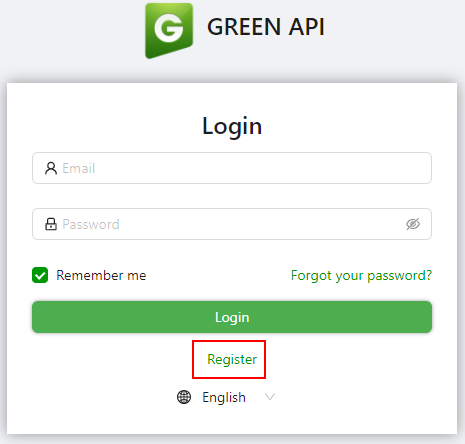
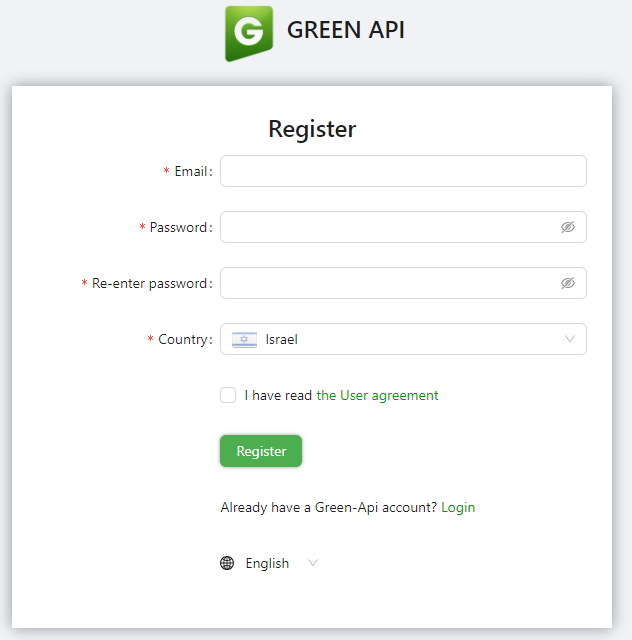
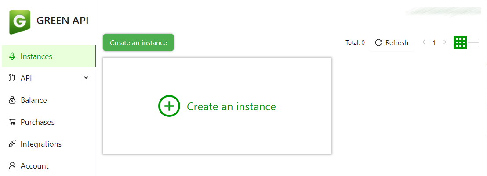
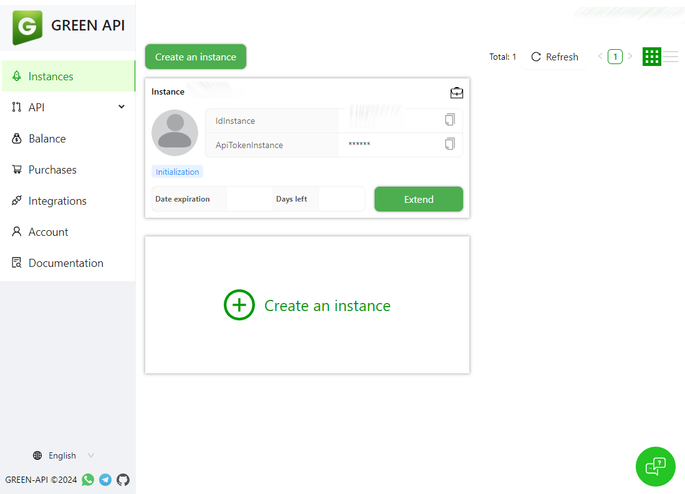
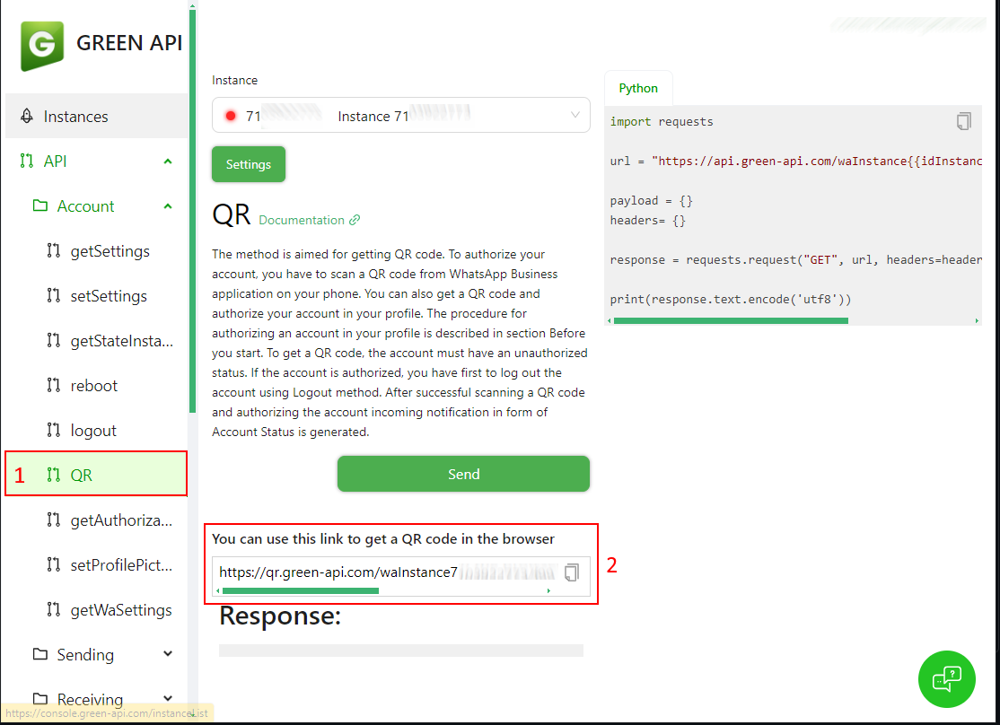
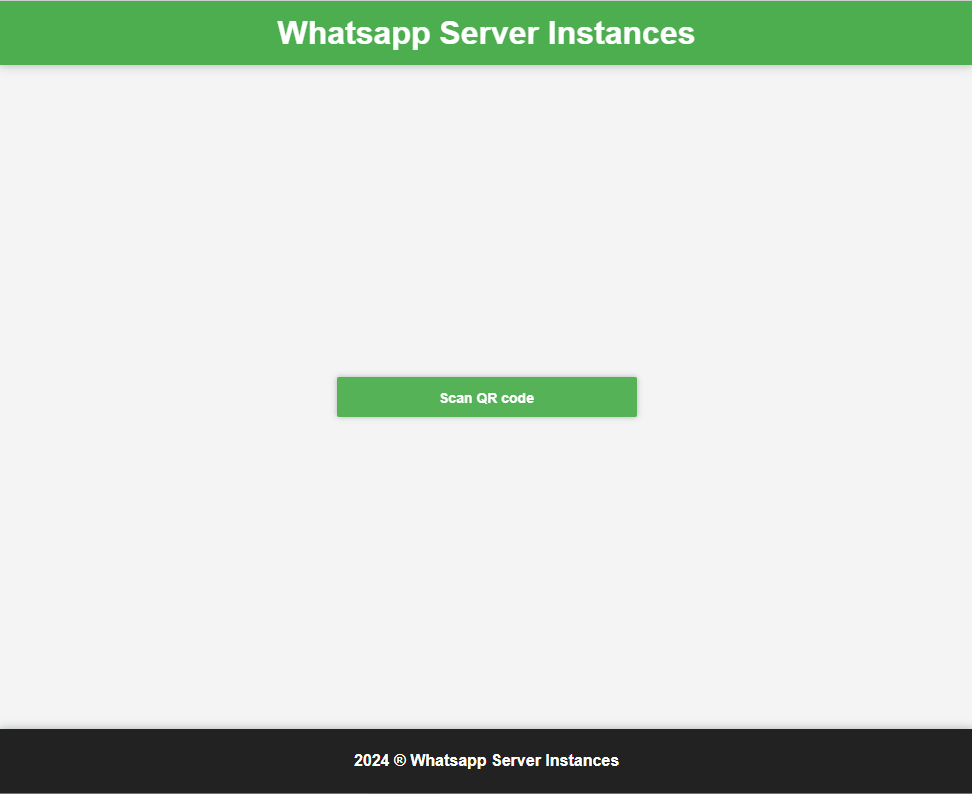
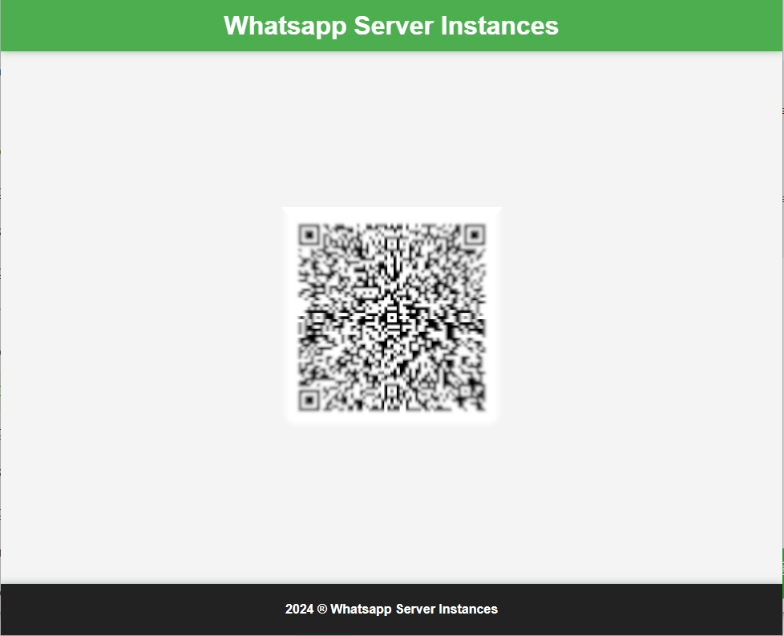
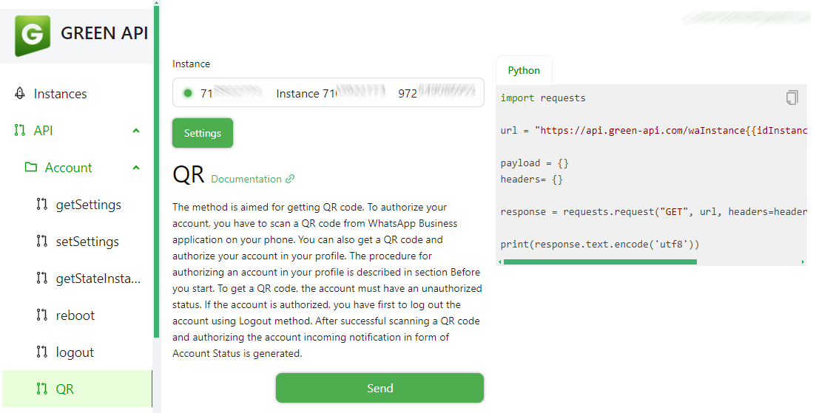
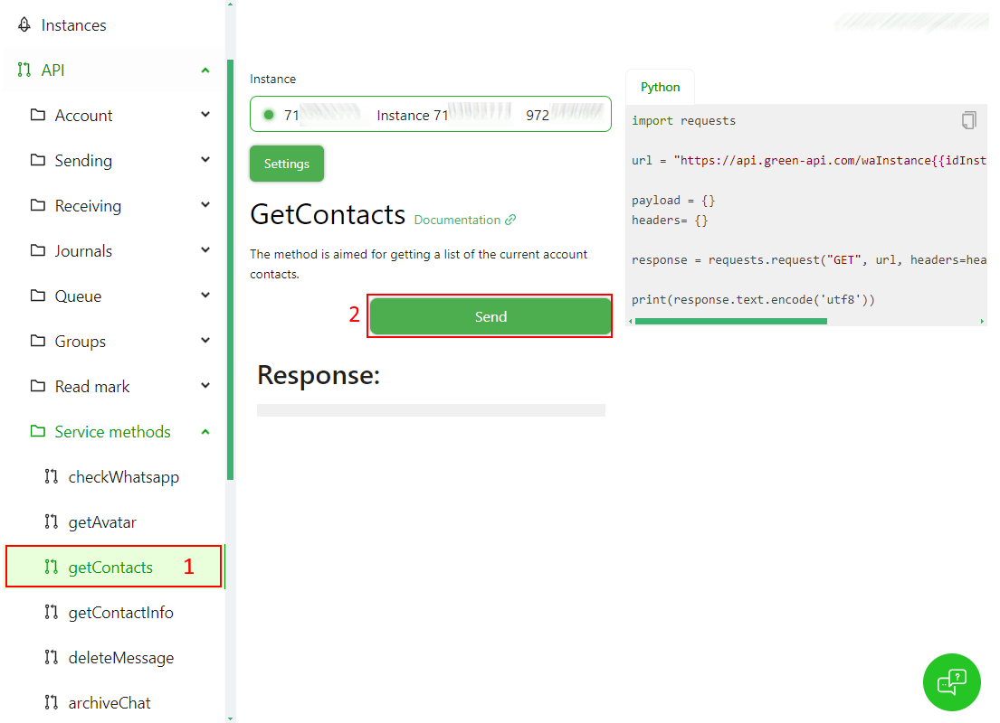
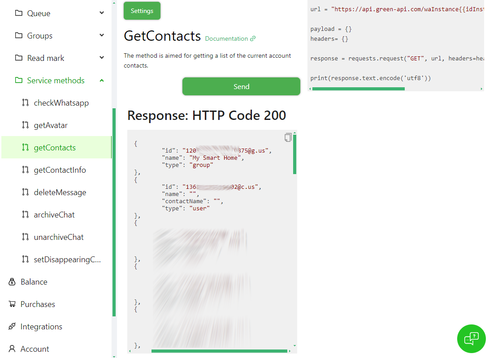

# GreenApi Arduino Library

The GreenApi Arduino Library allows you to easily send WhatsApp messages from your Arduino projects using the Green-API service. This library simplifies the process of integrating WhatsApp messaging capabilities into your Arduino sketches.

## Introduction

The GreenApi library provides a simple interface to interact with the Green-API service for sending WhatsApp messages. It abstracts away the complexities of HTTP requests and JSON formatting, allowing you to focus on your project's functionality.

## Supported boards

The library works on both **ESP32** and **ESP8266**. It automatically selects the
correct WiFi/HTTP client headers for the board you compile for, so the same sketch
runs on either chip — just include the matching WiFi header in your own sketch
(`<WiFi.h>` for ESP32, `<ESP8266WiFi.h>` for ESP8266). Green-API is served over
HTTPS; the library uses a secure client with certificate validation disabled
(`setInsecure()`) so no certificate needs to be provisioned on the device.

## Security note (TLS)

For portability and zero setup, the library connects with certificate
validation **disabled** (`WiFiClientSecure::setInsecure()`). The connection is
still encrypted, but the device does **not** verify the server's identity. On a
compromised or man-in-the-middle network an attacker could intercept the TLS
session and read the request — which includes your Green-API instance token (in
the URL) and the message contents.

This is a deliberate default: pinning a certificate in the library would break
message sending whenever Green-API rotates its certificate. If you need the
device to reject invalid or forged certificates, validate against Green-API's
root CA instead of calling `setInsecure()`:

- **ESP32:** `client.setCACert(rootCA);` (PEM string of the root CA).
- **ESP8266:** use `BearSSL::WiFiClientSecure` with
  `client.setTrustAnchors(&cert);` (or `client.setFingerprint(...)`), keeping in
  mind a pinned fingerprint must be updated on every certificate rotation.


## Getting started

### Setup Green API account
Nevigate to [https://green-api.com/en](https://green-api.com/en) and register for a new account:


Fill up your details and click on **Register**:



Next, click on the "Create an instance":



Select the "Developer" instance (Free):


Copy the InstanceId and Token, we need it for the integration settings:


Next, Lets connect our whatsapp with green-api. On the left side, Under API --> Account, click on QR and copy the QR URL to the browser and click on "Scan QR code"





Next, Scan the QR code to link you whatsapp with Green API:



After the account link, you will notice that the instance is active by the green light in the instance header:



### Getting the Contacts and Groups
Before we can start messaging, we need to get the Contact/Group details. we can do it using Green API endpoint.
On the lef side, Under API --> Service methods, click on "getContacts" and then click "Send":


As a result, you will get the list of Contacts and Groups.
* The contact number ends with **@c.us**
* The group number ends with **@g.us**



Write down the Id, you will need it to configure the notification.


## Installing the library

To use the GreenApi library in your Arduino projects, follow these steps:

1. Download the latest release of the GreenApi library from the [GitHub releases page](https://github.com/t0mer/GreenApi-WhatsApp-Library/releases).
2. Extract the downloaded ZIP file.
3. Move the extracted folder to the `libraries` directory in your Arduino sketchbook.
4. Restart the Arduino IDE.

## Usage

Here's a simple example sketch demonstrating how to use the GreenApi library to send a WhatsApp message:

```cpp
#include <Arduino.h>
#if defined(ESP32)
  #include <WiFi.h>          // ESP32 WiFi library
#elif defined(ESP8266)
  #include <ESP8266WiFi.h>   // ESP8266 WiFi library
#endif
#include <GreenApi.h>

const char* ssid = "YourWiFiSSID";
const char* password = "YourWiFiPassword";
const char* instanceId = "YourInstanceId";
const char* instanceToken = "YourInstanceToken";
const char* target = "YourChatId";
const char* message = "Hello, this is a test message from my new library!";

// Create an instance of the GreenApi class
GreenApi greenApi(instanceId, instanceToken);

void setup() {
  Serial.begin(115200);
  delay(1000);

  // Connect to Wi-Fi (if needed)
  Serial.println("Connecting to Wi-Fi...");
  WiFi.begin(ssid, password);
  while (WiFi.status() != WL_CONNECTED) {
    delay(500);
    Serial.print(".");
  }
  Serial.println("\nConnected to Wi-Fi!");

  // Send message using GreenApi
  Serial.println("Sending message...");
  greenApi.sendMessage(target, message);
}

void loop() {
  // Your code here
}
